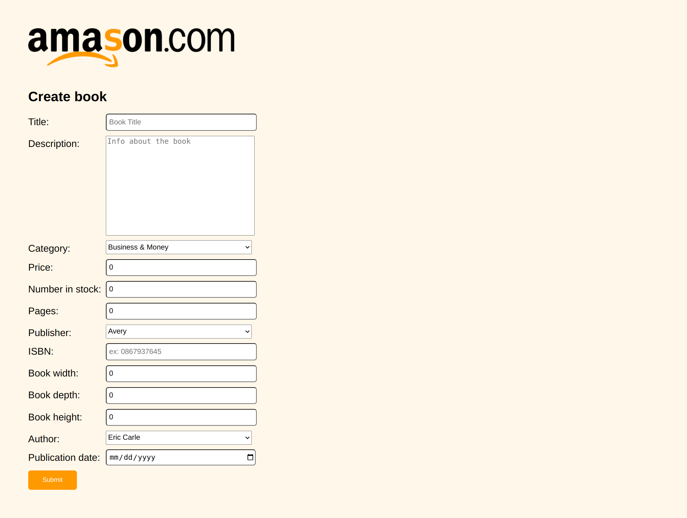
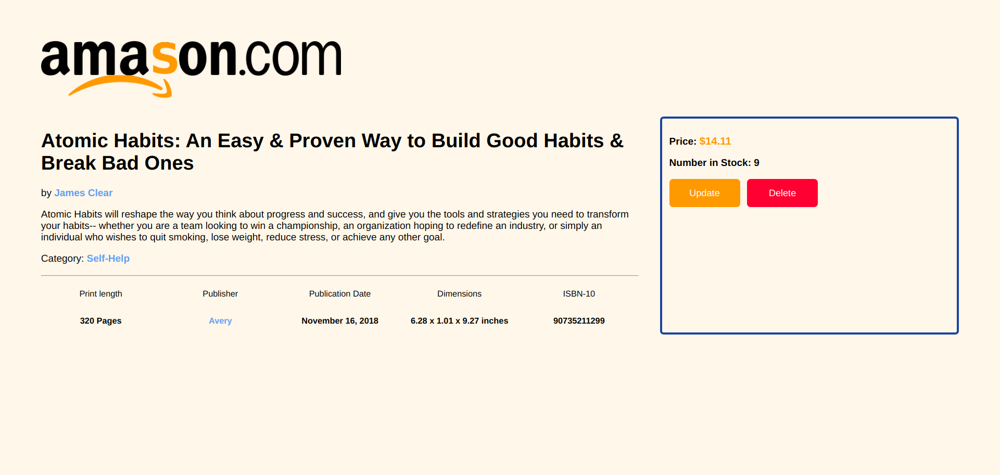

# inventory-application
An inventory application that allows user to add/update information about books.

The logo design and idea is a reference to Amazon.
# Features
- Create books, authors, categories, publishers
- View books according to attributes
- View details about a book
- Update info of items
- Delete items
# Details
- Use Node.js Framework
- Use pug for template
- Use MongoDB for database
- Deployed with Railway app
# Credits
If you can't see it, the website is clearly a reference to Amazon.
# Results
## Home Page

## Create Book

## Book Detail

## Author/Category/Publisher List

# Link
[Live Preview](https://inventory-application-ascodeasice.up.railway.app/)

Deploying on railway has a time limit, so you might not be able to see the preview